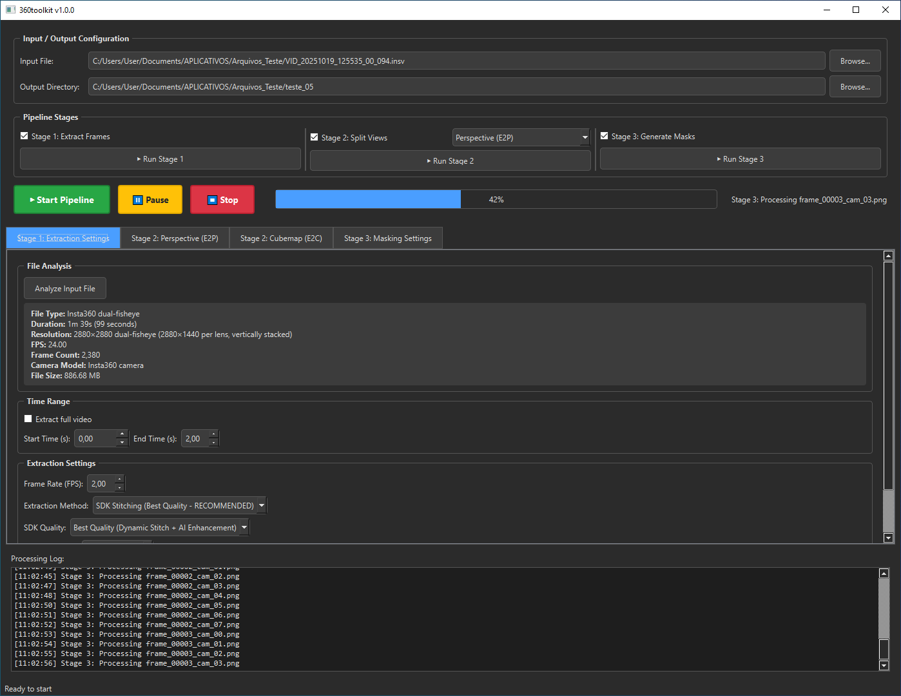

# 360toolkit



**Unified photogrammetry preprocessing pipeline**: Extract frames from Insta360 cameras → Split to perspective views → Generate AI masks

## 📥 Download

**[⬇️ Download 360toolkit v1.1.0 (Windows)](https://drive.google.com/file/d/1jIp3KkJQMqk_SDgJG5MM9jtnQN3jm51t/view?usp=sharing)** - Portable executable, no installation required (~5 GB)

---

**360toolkit** is a desktop application that combines frame extraction from Insta360 cameras with perspective splitting and AI masking for professional photogrammetry workflows.

## 🎯 Three-Stage Pipeline

`EXTRACT FRAMES (Insta360 SDK, FFMPEG)` → `SPLIT PERSPECTIVES (Equirectangular to Pinhole)` → `AI MASKING (YOLOv8)`

### **Stage 1: Frame Extraction** 🎬

- **Input**: `.INSV` (Insta360 native) or `.mp4` files
- **Output**: Equirectangular stitched panoramas (PNG/JPG)
- **Methods**:
  - **Insta360 MediaSDK 3.0.5** (PRIMARY): GPU-accelerated AI stitching with seamless blending
  - **FFmpeg Stitched**: For pre-stitched MP4 files
  - **FFmpeg Dual-Lens**: Extract both lenses separately
  - **FFmpeg Single Lens**: Extract front or back fisheye only
- **Features**:
  - Configurable FPS (0.1 - 30 frames/second)
  - Time range selection (start/end in seconds)
  - Resolution options: Original, 8K, 6K, 4K, 2K
  - **Quality Presets**:
    - **Best Quality**: Dynamic Stitch + AI Enhancement (v2 model)
    - **High Quality**: Dynamic Stitch + AI Enhancement (v1 model)
    - **Balanced**: Optical Flow stitching
    - **Fast Preview**: Template stitching

### **Stage 2: Perspective Splitting** 🔄

- **Input**: Equirectangular images
- **Output**: Rectilinear perspective views (PNG/JPEG/TIFF)
- **Compass-Based Camera Positioning**:
  - Default: 8 cameras arranged horizontally
  - Configurable FOV (30° - 150°)
  - Multi-ring support (main, look-up, look-down)
  - Custom yaw/pitch/roll per camera
- **Transform Engines**:
  - **E2P Transform**: Equirectangular → Pinhole perspective (cached for performance)
  - **E2C Transform**: Equirectangular → Cubemap (6-face + 8-tile variants)
  - **Real-time preview** with interactive compass widget
- **Output Customization**:
  - Custom image dimensions
  - Multiple format support (PNG, JPEG, TIFF)
  - Camera orientation data preserved in output

### **Stage 3: AI Masking** 🤖

- **Input**: Perspective images
- **Output**: Binary masks (`<image>_mask.png`, RealityScan compatible)
- **Detection Categories**:
  - Persons (primary)
  - Personal objects (bags, phones, backpacks, etc.)
  - Animals (all COCO animal classes)
- **Features**:
  - YOLOv8 instance segmentation (5 model sizes: nano → xlarge)
  - **ONNX Runtime Integration**: Lightweight, fast CPU/GPU inference
  - **Smart Skipping**: Skips mask generation for images without detected objects
  - Configurable confidence threshold

---

## 🚀 Recent Updates (v1.1.0)

- **Fixed SDK Stitching Quality**: Corrected stitch type mapping - now uses `dynamicstitch` for best quality output matching Insta360 Studio
- **Professional Quality Presets**: Renamed SDK options to clear, professional labels
- **AI Model v2 Support**: Best quality preset now uses AI stitcher model v2 for superior blending
- **Fixed ONNX Model Compatibility**: Re-exported YOLOv8 model with opset 17 for onnxruntime 1.20.1 compatibility
- **Optimized Masking Pipeline**: ONNX-based inference for lightweight, fast processing without PyTorch dependency
- **Fixed SDK Black Image Issue**: Resolved path resolution errors for SDK models.
- **RTX 50-Series Compatibility**: Added automatic CPU fallback for masking on unsupported GPUs (e.g., RTX 5070 Ti).
- **Performance Boost**: 
  - **Stage 2 GPU Acceleration**: Uses PyTorch for ultra-fast perspective splitting (10x faster).
  - **Stage 2 CPU Parallelism**: Uses all CPU cores when GPU is unavailable.

---

## 📦 Installation

### Option 1: Portable Executable (Recommended)

**No installation required!** Download `360ToolkitGS-ONNX.zip` and extract. Works on any Windows 10/11 machine.

```powershell
# Extract and run
.\360ToolkitGS-ONNX.exe
```

**Requirements**:
- Windows 10/11 64-bit
- 4 GB free disk space (ONNX version)
- Optional: NVIDIA GPU for faster masking

### Option 2: Development Setup

Clone repository and set up Python environment:

```bash
git clone https://github.com/Everton-Braz/360toolkit.git
cd 360toolkit

# Create virtual environment
python -m venv .venv
.venv\Scripts\activate

# Install dependencies
pip install -r requirements.txt

# Run application
python run_app.py
```

### SDK Setup (Critical)

For the Insta360 MediaSDK to work correctly, you must ensure the model files are in the correct location relative to the executable.

1. Locate your Insta360 MediaSDK folder.
2. Copy the `models` folder.
3. Paste it inside the `bin` folder (where `MediaSDKTest.exe` resides).
   - Structure should be: `.../MediaSDK/bin/models/`

**Requirements**:
- Python 3.10+
- ONNX Runtime 1.20+ (CPU or GPU)
- PyQt6
- OpenCV, NumPy
- Insta360 MediaSDK 3.0.5

---

## 🚀 Quick Start

### Using the Portable Application

1. Launch `360ToolkitGS-ONNX.exe`
2. **Stage 1**: Select `.INSV`/`.mp4` file, configure extraction settings, click "Extract"
3. **Stage 2**: Adjust compass settings, preview splits, click "Split"
4. **Stage 3**: Enable masking categories, click "Generate Masks"
5. Output saved to configured output folder

### Basic Workflow

1. **Stage 1**: Load `.INSV` file → Set FPS (e.g., 1.0) → Select quality preset → Extract
2. **Stage 2**: Configure compass (8 cameras, 110° FOV) → Split to perspectives
3. **Stage 3**: Enable categories (persons, objects, animals) → Generate masks
4. **Click "Start Pipeline"** → All stages run automatically

### Output Structure

```
output/
├── stage1_frames/       # Stage 1: Equirectangular images
├── stage2_perspectives/ # Stage 2: Camera views (8 per frame)
└── stage3_masks/        # Stage 3: Binary masks (*_mask.png)
```

---

## 📁 Project Structure

```
360toolkit/
├── src/
│   ├── extraction/           # Stage 1: Frame extraction
│   │   ├── sdk_extractor.py  # Insta360 MediaSDK integration
│   │   └── frame_extractor.py # FFmpeg fallback
│   ├── transforms/           # Stage 2: Perspective splitting
│   │   ├── e2p_transform.py  # Equirect → Pinhole (cached)
│   │   └── e2c_transform.py  # Equirect → Cubemap
│   ├── masking/              # Stage 3: AI masking
│   │   └── onnx_masker.py    # ONNX Runtime YOLOv8
│   ├── pipeline/             # Batch orchestration
│   │   ├── batch_orchestrator.py
│   │   └── metadata_handler.py
│   ├── ui/                   # PyQt6 interface
│   │   └── main_window.py
│   ├── config/               # Configuration
│   │   └── defaults.py
│   └── main.py               # Application entry point
├── resources/                # Images and assets
├── scripts/                  # Build scripts
├── specs/                    # UI specifications
├── tests/                    # Unit tests
├── runtime_hook_onnx.py      # ONNX runtime hook
├── runtime_hook_sdk.py       # SDK environment setup
├── 360ToolkitGS-ONNX.spec    # PyInstaller build spec
├── yolov8m-seg.onnx          # AI model (medium)
├── requirements.txt
├── LICENSE
└── README.md
```

---

## ⚙️ Configuration

### SDK Quality Presets

| Preset | Stitch Type | AI Model | Speed | Quality |
|--------|-------------|----------|-------|---------|
| **Best Quality** | Dynamic Stitch | v2 | ~2.2s/frame | ★★★★★ |
| **High Quality** | Dynamic Stitch | v1 | ~1.5s/frame | ★★★★☆ |
| **Balanced** | Optical Flow | v1 | ~1.0s/frame | ★★★☆☆ |
| **Fast Preview** | Template | None | ~0.5s/frame | ★★☆☆☆ |

### Camera Presets

Predefined camera group configurations in `src/config/camera_presets.json`:
- **8-Camera Horizontal**: 8 cameras in horizontal ring, 110° FOV (default)
- **4-Cardinal**: N/S/E/W positioning, 90° FOV
- **16-Camera Dome**: 8 main + 4 up + 4 down
- **Custom**: User-defined via UI or JSON

### Masking Categories

Edit in UI or `src/config/defaults.py`:
```python
MASKING_CATEGORIES = {
    'persons': True,
    'personal_objects': True,  # backpack, phone, suitcase, etc.
    'animals': True            # COCO animal classes
}
```

---

## 📊 Performance

### Stage 1: Frame Extraction
- **SDK Method**: ~1.5-2.5 seconds per frame (GPU-accelerated, best quality)
- **FFmpeg Method**: ~1-2 seconds per frame (for pre-stitched files)

### Stage 2: Perspective Splitting
- **E2P Transform**: ~0.1-0.2 seconds per frame (with caching)
- **E2C Transform**: ~0.15-0.3 seconds per frame

### Stage 3: AI Masking (ONNX Runtime)
- **CPU (i7/Ryzen 7)**: ~1-3 seconds per image
- **GPU (CUDA)**: ~0.3-0.5 seconds per image

---

## 🐛 Troubleshooting

### SDK Not Found
```
Error: Insta360 MediaSDK not detected
Solution: Included in portable build; if building from source, ensure SDK at:
C:\Users\[User]\Windows_CameraSDK-2.0.2-build1+MediaSDK-3.0.5-build1\
```

### Memory Issues
```
Error: Out of memory during masking
Solution: Use smaller YOLOv8 model (nano/small) or reduce batch size
```

### ONNX Model Errors
```
Error: Model opset version incompatible
Solution: Re-export model with opset 17: ultralytics export yolov8m-seg.pt format=onnx opset=17
```

---

## 🔧 Build from Source (PyInstaller)

### Prerequisites
- Python 3.10+
- ONNX Runtime 1.20+
- PyInstaller 6.16.0
- Insta360 MediaSDK 3.0.5

### Build Command (ONNX Version)
```powershell
pyinstaller 360ToolkitGS-ONNX.spec --clean
```

**Output**: `dist\360ToolkitGS-ONNX\` (~1.5 GB)

---

## 🔌 Integration with Photogrammetry Software

Output can be used with:
- **RealityScan (RealityCapture)** - Primary target, uses mask format
- **Metashape (Agisoft)**
- **COLMAP**

---

## ⚖️ Legal & Licensing

**360toolkit** is open-source software licensed under the [MIT License](LICENSE).

This software depends on the **Insta360 Camera SDK**, which is proprietary software owned by Arashi Vision Inc. (Insta360).

- **360toolkit Source Code**: Free and open-source under MIT License.
- **Insta360 SDK**: Proprietary software, free for development use but NOT open-source. Redistributed under the [Insta360 SDK EULA](https://www.insta360.com/support/supportcourse?post_id=20734).
- **Trademarks**: "Insta360" is a trademark of Arashi Vision Inc. This project is unofficial and not affiliated with Insta360.

### Insta360 SDK Notice
The **Insta360 MediaSDK** is **proprietary** and NOT included in this source code repository.
- **For Users**: Pre-built releases include necessary SDK runtime files.
- **For Developers**: Download the SDK from the [Insta360 Developer Portal](https://www.insta360.com/sdk/home).

---

## 🙏 Acknowledgments

- **Insta360 MediaSDK 3.0.5**: Official stitching engine
- **Ultralytics YOLOv8**: Instance segmentation
- **ONNX Runtime**: Cross-platform inference
- **PyQt6**: Desktop UI framework

---

## 📞 Support

For issues, feature requests, or questions:
- Open an Issue on GitHub
- Check existing documentation in `specs/` folder
- Review test cases in `tests/` folder

---

**Version**: 1.1.0  
**Last Updated**: December 2025  
**Status**: Production Ready ✅
