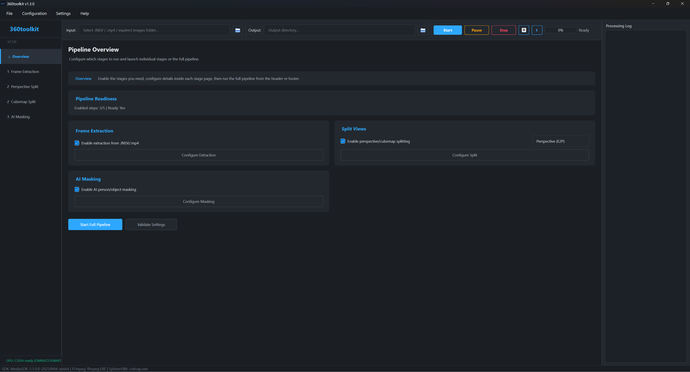

# 360toolkit



360toolkit is a Windows-first PyQt6 application for photogrammetry preprocessing from 360 capture. It extracts stitched equirectangular frames, converts them into perspective or cubemap views, and generates masking assets for downstream tools such as RealityScan.

## Use It Two Ways

- Open-source source repo: develop and run the pipeline from Python in this repository.
- Paid Windows bundle: get the prebuilt desktop release from Gumroad: <https://evertonbraz.gumroad.com/l/360toolkit>

## Current Pipeline

`Extract Frames` -> `Split Views` -> `Mask Images`

### Stage 1: Extract Frames

- Input: `.insv` and `.mp4`
- Output folder: `extracted_frames/`
- Primary method: Insta360 MediaSDK stitching
- FFmpeg stitched mode is only for pre-stitched `.mp4` input
- Raw `.insv` stitched export should use SDK stitching; FFmpeg raw modes are for dual-lens or lens-specific fisheye export only
- Configurable FPS, start/end range, resolution, and output format
- Current default FPS is `2.0`

### Stage 2: Split Views

- Input: auto-discovered from `extracted_frames/` or supplied explicitly with the Stage 2 input folder
- Output folder: `perspective_views/`
- Transform modes:
  - Perspective split (E2P)
  - Cubemap 6-face
  - Cubemap 8-tile
- Current default transform is `cubemap_8tile`
- Stage 2 supports:
  - Preserve-source or sequential frame numbering
  - Flat or by-camera folder layout
  - Split-only runs from an existing equirectangular folder
- Current defaults:
  - Frame numbering: `preserve_source`
  - Folder layout: `flat`

### Stage 3: Mask Images

- Current GUI workflow uses external `SAM3.cpp` person masking
- Configure `segment_persons.exe`, a SAM3 model such as `sam3-q4_0.ggml`, and optionally `sam3_image.exe` in `Settings > Paths & Detection`
- Stage 3 supports:
  - Auto source selection between perspective views and extracted equirectangular frames
  - Mask-only runs from an explicit Stage 3 input folder
  - Preview generation through the SAM3 preview widget
  - Alpha-export and alpha-only modes
  - Custom prompt text and refinement controls
- Output folders:
  - `masks_perspective/`
  - `masks_equirect/`
  - `alpha_cutouts/` when alpha-only output is used

## PNG vs JPEG/TIFF Behavior

The pipeline order changes based on the Stage 2 image format.

- PNG split output: when Stage 2 and Stage 3 are both enabled, masking runs first on `extracted_frames/`, writes `alpha_cutouts/`, and Stage 2 splits those alpha images afterward.
- JPEG or TIFF split output: Stage 2 runs first, then Stage 3 masks the generated split images.

That branch exists so PNG workflows can preserve transparency through the split stage.

## Output Layout

Typical project output looks like this:

```text
output/
├── extracted_frames/
├── perspective_views/
├── masks_perspective/
├── masks_equirect/
└── alpha_cutouts/
```

Not every folder is created on every run. The exact set depends on which stages are enabled and whether Stage 3 is targeting equirectangular frames, split views, or alpha-only export.

## Source Setup

### Requirements

- Windows 10/11
- Python 3.10+
- FFmpeg available on `PATH` for FFmpeg extraction modes
- Insta360 MediaSDK for SDK stitching
- External SAM3.cpp binaries and model files for Stage 3

### Install

```powershell
git clone https://github.com/Everton-Braz/360toolkit.git
cd 360toolkit

python -m venv .venv
.\.venv\Scripts\Activate.ps1
pip install -r requirements.txt
python run_app.py
```

## CLI Mode

The application also exposes a CLI entry through `src/main.py`.

```powershell
python -m src.main --cli --input <input.insv> --output <output-folder> --stage all
```

Useful options include:

- `--stage all|extract|split|mask`
- `--stage2-input-dir <folder>`
- `--stage3-input-dir <folder>`
- `--stage2-numbering preserve_source|sequential`
- `--stage2-layout flat|by_camera`

## Repository Layout

```text
360toolkit/
├── src/
│   ├── extraction/
│   ├── masking/
│   ├── pipeline/
│   ├── transforms/
│   ├── ui/
│   └── config/
├── resources/
├── docs/
├── specs/
├── tests/
├── run_app.py
├── requirements.txt
└── README.md
```

The maintained automated test suite lives under `tests/`. Root-level one-off diagnostics and commercial packaging files are intentionally excluded from the public repo.

## Notes

- The repo is source-focused. If you want the packaged Windows application, use the Gumroad release.
- Stage 1 SDK stitching and the current Stage 3 SAM3.cpp workflow are both Windows-oriented.
- RealityScan-compatible masks follow the usual convention: `0 = remove`, `255 = keep`.
